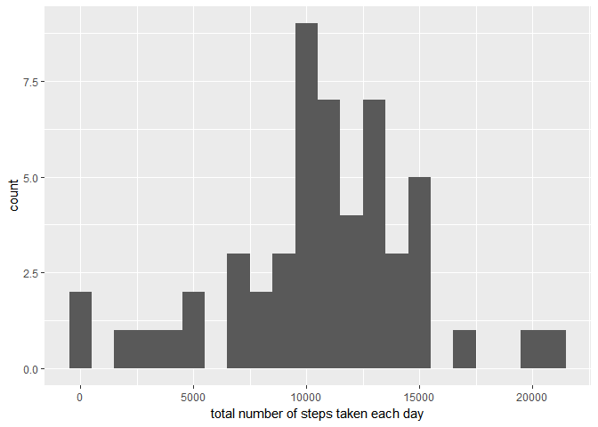

```r
library("ggplot2")
library(dplyr)
```

```
## 
## Attaching package: 'dplyr'
```

```
## The following objects are masked from 'package:stats':
## 
##     filter, lag
```

```
## The following objects are masked from 'package:base':
## 
##     intersect, setdiff, setequal, union
```

```r
setwd("/Users/Michel/Dropbox/Coursera/Data Science - John Hopkin's/Reproducible Research/week2/Course Project 1")
```

## Loading and preprocessing the data
### We want to ignore NA values

```r
activities <- read.csv("activity.csv", na.strings = "NA" )
filtered_activities <- na.omit(activities)
```

## What is mean total number of steps taken per day?

```r
total_steps_per_day <- filtered_activities %>% 
  group_by(date) %>% 
  summarise(total_steps = sum(steps))

mean_steps <- mean(total_steps_per_day$total_steps)
median_steps <- median(total_steps_per_day$total_steps)

qplot(total_steps_per_day$total_steps, binwidth=1000, xlab="total number of steps taken each day")
```

<!-- -->

The mean of the of the total number of steps is 10766.  
The median of the of the total number of steps is 10765. 


## What is the average daily activity pattern?

```r
average_steps_per_interval <- filtered_activities %>% 
    group_by(interval) %>% 
    summarise(avg_steps =mean(steps))


plot(average_steps_per_interval$interval, average_steps_per_interval$avg_steps, type="l", xlab="Interval", 
     ylab="Average number of steps")
```

<!-- -->

```r
Max_steps <- max(average_steps_per_interval$avg_steps)
average_steps_per_interval[average_steps_per_interval$avg_steps == Max_steps,]
```

```
## # A tibble: 1 x 2
##   interval avg_steps
##      <int>     <dbl>
## 1      835  206.1698
```

## Imputing missing values


## Are there differences in activity patterns between weekdays and weekends?
