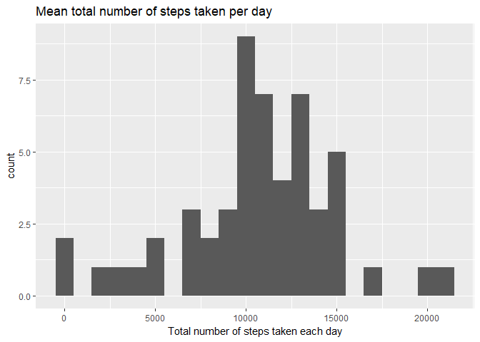
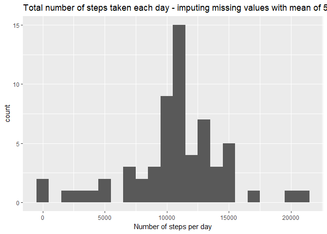

# Michel Racine

```r
library("ggplot2")
library(dplyr)
```

```
## 
## Attaching package: 'dplyr'
```

```
## The following objects are masked from 'package:stats':
## 
##     filter, lag
```

```
## The following objects are masked from 'package:base':
## 
##     intersect, setdiff, setequal, union
```

```r
library(lubridate)
```

```
## 
## Attaching package: 'lubridate'
```

```
## The following object is masked from 'package:base':
## 
##     date
```

```r
library(chron)
```

```
## Warning: package 'chron' was built under R version 3.4.4
```

```
## 
## Attaching package: 'chron'
```

```
## The following objects are masked from 'package:lubridate':
## 
##     days, hours, minutes, seconds, years
```

```r
library(lattice)
```

## Loading and preprocessing the data
### We want to ignore NA values

```r
data <- read.csv("activity.csv")
filtered_data <- na.omit(data)
```

## What is mean total number of steps taken per day?

```r
total_steps_per_day <- aggregate(steps ~ date, data, sum)


mean_steps <- mean(total_steps_per_day$steps)
median_steps <- median(total_steps_per_day$steps)

qplot(total_steps_per_day$steps, binwidth=1000, xlab="Total number of steps taken each day", main="Mean total number of steps taken per day")
```

<!-- -->

The mean of the of the total number of steps is 10766.  
The median of the of the total number of steps is 10765. 


## What is the average daily activity pattern?

```r
steps_per_interval <- aggregate(steps ~ interval, data, mean)


plot(steps_per_interval$interval, steps_per_interval$steps, type="l", xlab="Interval", 
     ylab="Average number of steps")
```

<!-- -->

```r
Max_steps <- max(steps_per_interval$steps)
Max_interval <- steps_per_interval[steps_per_interval$steps == Max_steps,]$interval
```
The interval  835 on average contains the maximum number of steps, which is  206.

## Replace missing values by using the mean for the 5-minute interval
### We will re-use the steps_per_interval data frame...

```r
missing_values = sum(!complete.cases(data))

data.i <- transform(data, steps = ifelse(is.na(data$steps), steps_per_interval$steps[match(data$interval, steps_per_interval$interval)], data$steps))

total_steps_per_day.i <- aggregate(steps ~ date, data.i, sum)

mean_steps.i <- mean(total_steps_per_day.i$steps)
median_steps.i <- median(total_steps_per_day.i$steps)

qplot(total_steps_per_day.i$steps, binwidth=1000, xlab="Number of steps per day", main="Total number of steps taken each day - imputing missing values with mean of 5-minute intervals")
```

<!-- -->

## Are there differences in activity patterns between weekdays and weekends?

data.i$weekday <- ifelse(is.weekend(data.i$date), "Weekend", "Weekday")

steps_per_interval.i <- aggregate(steps ~ interval + weekday, data.i, mean)

xyplot(steps_per_interval.i$steps ~ steps_per_interval.i$interval|steps_per_interval.i$weekday, main="Average Steps per Day by Interval",xlab="Interval", ylab="Steps",layout=c(1,2), type="l")


